# SwiftWing Claude Code Hooks

## Active Hooks

### UserPromptSubmit: enforce-planning.sh
**Purpose:** Automatically detect complex tasks and enforce planning-with-files usage

**Triggers When:**
- Complexity score ≥5 (roughly >3 tool calls expected)
- Keywords: build fail, debug, refactor, integrate, multiple files, etc.

**Behavior:**
- **Score <5:** Prompt passes through (simple tasks)
- **Score ≥5:** Blocks execution, shows warning, requires `/planning-with-files`
- **Override:** Add "skip-planning" to prompt (use sparingly)

**Example Output:**
```
╔════════════════════════════════════════════════════════════════╗
║  🚨 COMPLEXITY THRESHOLD EXCEEDED (Score: 8/5)                 ║
║                                                                ║
║  This task appears to require >3 tool calls.                   ║
║  MANDATORY: Use /planning-with-files skill first               ║
║                                                                ║
║  Recommended Workflow:                                         ║
║  1. /planning-with-files - Create structured plan              ║
║  2. Use specialist Task agents (Explore, Plan, etc.)           ║
║  3. Review outputs with PAL MCP grok-code-fast-1               ║
║  4. Work systematically with persistent memory                 ║
╚════════════════════════════════════════════════════════════════╝

❌ BLOCKED: Please invoke /planning-with-files before proceeding
```

### SessionStart: Startup Banner
**Purpose:** Remind user of project context and planning policy

**Output:**
```
📱 SwiftWing iOS 26 | Epic-based development | Planning mandatory for >3 tool calls
```

## Complexity Scoring Algorithm

### High Complexity (+3 points each)
- build.*fail
- fix.*error
- debug
- refactor.*multiple
- integrate
- architecture
- performance.*optimi
- going.*circle
- keep.*fail
- not.*work
- still.*broken
- multi.*step
- several.*file

### Medium Complexity (+2 points each)
- add.*feature
- implement
- create.*and
- update.*and
- review.*and.*fix
- migrate
- refactor
- analyze

### Multi-File Indicators (+2 points each)
- across.*file
- [0-9]+.*file
- all.*swift
- entire.*codebase
- multiple.*component

### Multi-Step Verbs (+1 point each)
- then
- after.*that
- next
- also
- additionally
- furthermore

## Testing the Hook

**Test Case 1: Simple Task (Should Pass)**
```bash
User: "Fix typo in README line 42"
# Score: 0 → Passes through ✅
```

**Test Case 2: Complex Task (Should Block)**
```bash
User: "Fix the build failures in LibraryView and update the camera integration"
# Score: 8 (fix, build, fail: +3, update.*and: +2, multiple implied: +2)
# → BLOCKED, requires /planning-with-files ❌
```

**Test Case 3: Override (Should Pass with Warning)**
```bash
User: "Refactor TalariaService and add error handling skip-planning"
# Score: 7 (refactor: +2, add: +2, and: +1)
# → Shows warning but proceeds ⚠️
```

## Maintenance

**To adjust sensitivity:**
Edit `enforce-planning.sh` and modify:
```bash
THRESHOLD=5  # Lower = more strict, Higher = more lenient
```

**To add new patterns:**
```bash
HIGH_COMPLEXITY_PATTERNS+=(
    "your.*new.*pattern"
)
```

**To disable temporarily:**
Comment out hook in `.claude/settings.json`:
```json
"UserPromptSubmit": [
  // {
  //   "hooks": [...]
  // }
]
```

## Workflow Integration

**1. Hook Triggers → 2. User Invokes Planning → 3. Claude Uses Specialists + PAL**

```mermaid
graph TD
    A[User Submits Prompt] --> B{Hook: Complexity Check}
    B -->|Score <5| C[Execute Directly]
    B -->|Score ≥5| D[Block + Show Warning]
    D --> E[User: /planning-with-files]
    E --> F[Create Planning Files]
    F --> G[Launch Specialist Agents Concurrently]
    G --> H[PAL Review with grok-code-fast-1]
    H --> I[Systematic Implementation]
    I --> J[Verify: xcodebuild + xcsift]
    J --> K{0 errors, 0 warnings?}
    K -->|Yes| L[Complete ✅]
    K -->|No| M[Log Error, Retry]
    M --> I
```



## Related Documentation

- `.claude/rules/planning-workflow.md` - Full workflow guide
- `.claude/rules/planning-mandatory.md` - Planning policy
- `.claude/rules/build-workflow.md` - Build verification rules
- `CLAUDE.md` - Main project instructions

## Troubleshooting

**Hook Not Running:**
```bash
# Check permissions
ls -la .claude/hooks/enforce-planning.sh
# Should show: -rwxr-xr-x (executable)

# Make executable if needed
chmod +x .claude/hooks/enforce-planning.sh
```

**Hook Blocking Too Much:**
```bash
# Lower threshold in enforce-planning.sh
THRESHOLD=7  # Was 5, now more lenient
```

**Hook Not Blocking Enough:**
```bash
# Raise threshold or add more patterns
THRESHOLD=3  # Was 5, now more strict
```

**Emergency Disable:**
```bash
# Rename hook temporarily
mv .claude/hooks/enforce-planning.sh .claude/hooks/enforce-planning.sh.disabled
```
